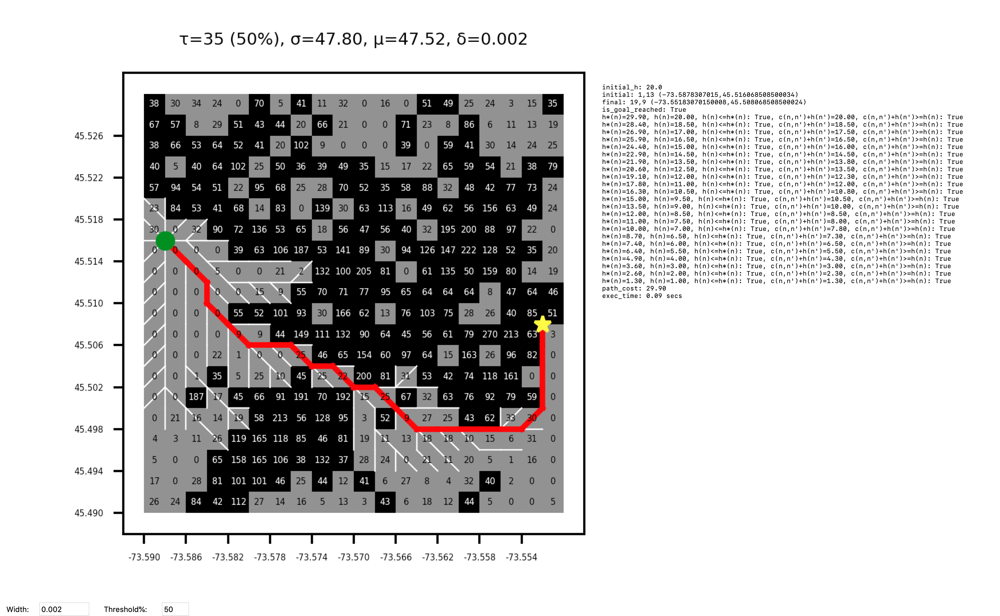

# MontrealCrimeAnalytics

This app finds the shortest path using the A* algorithm between two points on a map based on crime data for the Montreal region. Each region, depending on threshold percentage supplied, will draw a set of black squares where the amount of crime in that area exceeds a representative threshold value (calculated with the supplied threshold percent in the textbox). Each square size is determined by the supplied edge width (also supplied via a textbox). A particular square (cell) can only be traversed diagonally if it is *not\* a high crime cell (i.e. is not black). A path edge is only possible if one of the two adjacent cells involved is not black.

The path costs are explained below:

- 1.0 for each orthogonal single step vertex to vertex movements between two non high crime cells
- 1.3 for each orthogonal single step vertex to vertex movements between one high crime cell and one non high crime cell
- 1.5 for each diagonal single step vertex to vertex movements across non high crime cells

The heuristic uses the path cost information to estimate the cost from any vertex to a goal vertex as follows:

`h(n) = 1.5 * min(|di|, |dj|) + 1.0 * (max(|di|, |dj|) - min(|di|, |dj|))`

where `|di| = abs(node_current.i - node_goal.i)` and `|dj| = abs(node_current.j - node_goal.j)`

This ensures that the heuristic estimate is based on being able to go diagonal to the goal node in the most steps possible each at 1.5 cost, whereas any remaining orthogonal movements are performed with an assumed cost of 1.0 (representing the lowest cost scenario to avoid any overestimates).

Python 3.7+ is required to run the app. Once you have your Python environment set up, install the necessary dependencies by entering:

```shell
$ pip install -r requirements.txt
```

Once the dependencies are installed, simply run the app by entering:

```shell
$ python app.py
```

Then click anywhere on the graph to pick a start and end point for the algorithm to find the optimal path using A\*.

You can also change the width and threshold percent in the text boxes in the bottom left corner of the window.

See the `requirements.txt` file for the list of dependencies required.

## Screenshot


